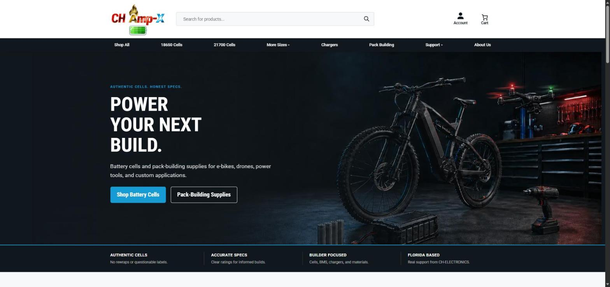
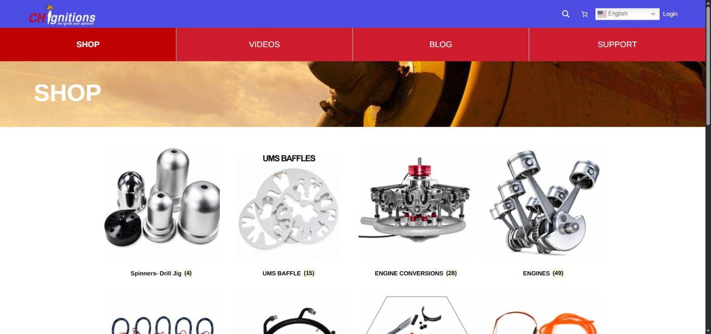

# CH-AMPX × CH-IGNITIONS — Ecosistema e-commerce con WooCommerce

> **Caso de estudio · trabajo anterior.** Gestioné el desarrollo y la operación de dos tiendas WooCommerce conectadas entre sí. Este repositorio documenta el proyecto; el código de producción pertenece al cliente y no se publica.

- **Rol:** Desarrollador web / administrador del sitio
- **Stack:** WordPress · WooCommerce · WooCommerce REST API · PHP (snippets) · Jetpack · Cloudflare / GoDaddy DNS · WordPress.com
- **Sitios:** [ch-ampx.com](https://ch-ampx.com) · [ch-ignitions.com](https://ch-ignitions.com)

---

## El reto

Dos marcas con tiendas independientes que debían comportarse como **un solo ecosistema**: catálogo e inventario sincronizados, y un flujo de compra que podía empezar en un sitio y terminar en el otro.

## Lo que construí

### 1. Sincronización entre tiendas
- Integración entre ambos sitios con la **WooCommerce REST API**.
- **Snippets PHP** propios para sincronizar productos y datos entre tiendas.
- Manejo de entornos *staging* → producción (actualización de URLs en la lógica de sincronización al pasar a producción).

### 2. Checkout entre sitios
- Flujo de **checkout cruzado**: el cliente puede navegar en una tienda y completar la compra en la otra sin perder el carrito.

### 3. Migración de dominio y resolución de incidente
Durante una migración de dominio, una mala configuración de DNS rompió **Jetpack**, el **carrito de WooCommerce** y la caché nativa de páginas.

- Diagnostiqué el problema: al principio parecía de Cloudflare, pero la causa real estaba en la configuración DNS de **GoDaddy**.
- Coordiné con el soporte de **WordPress.com** para restablecer el servicio.
- Recuperé el funcionamiento del carrito, Jetpack y la caché.

### 4. Rendimiento
- Auditoría y optimización del rendimiento de CH-AMPX después de la migración: caché, conflicto de DNS entre Cloudflare y WordPress.com, y carga de páginas.

## Qué aprendí
- Integrar sistemas por API cuando la plataforma no lo trae de fábrica.
- Diagnosticar incidentes en producción por capas: DNS → CDN → hosting → aplicación.
- Trabajar con proveedores externos (registrador de dominio, hosting gestionado) bajo presión.
## Capturas

| CH-AMPX | CH-IGNITIONS |
|---|---|
|  |  |
